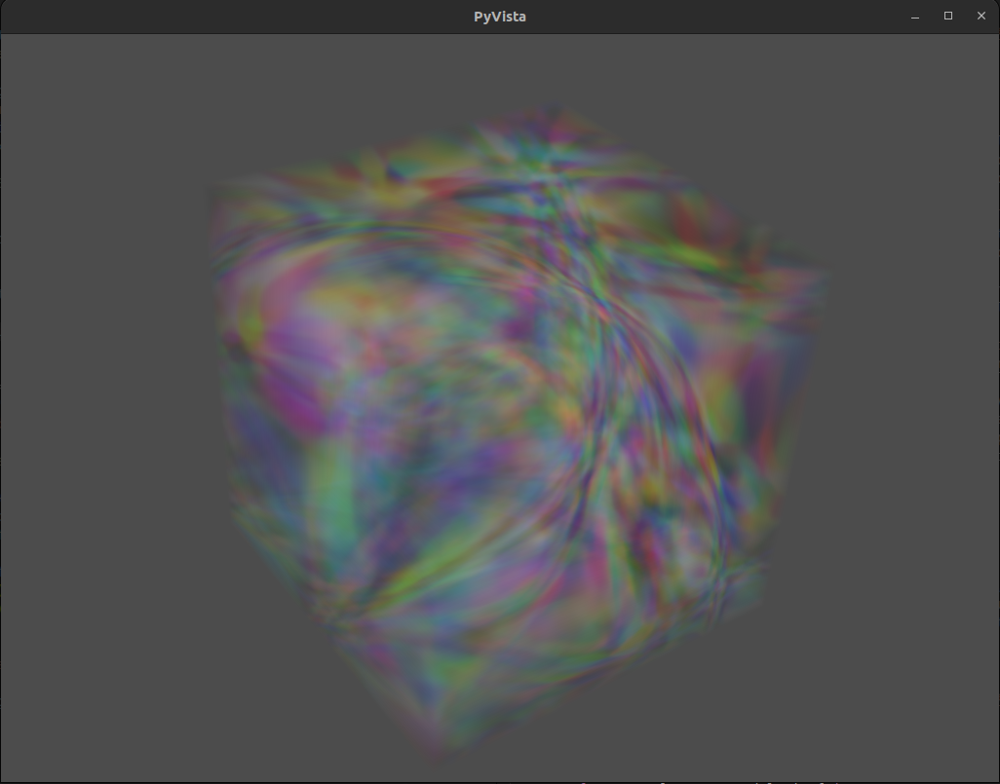

# Neural Canvas: creative deep learning through implicit data representations

<div align="center">
</img>
</div>

# Overview

Neural canvas is a Python library that provides tools for working with implicit neural representations of data. This library is designed to make it easy for artists and researchers to experiment with various types of implicit neural representations and create stunning images and videos.

Implicit neural representations, also called [neural fields](https://neuralfields.cs.brown.edu/) are a powerful class of models that can learn to represent complex patterns in data. 
They work by learning to map a set of inputs to a continuous function that defines the implicit shape of the data. 
This resembles an optimization problem rather than machine learning, where machine learning techniques usually seek to find some configuration that generalizes to lots of data on some task. 
Examples of implicit neural representations include NERFs ([Neural Radiance Fields](https://arxiv.org/abs/2003.08934v2)) for 3D data, or CPPNs ([Compositional Pattern-Producing Networks](https://blog.otoro.net/2016/03/25/generating-abstract-patterns-with-tensorflow/)) for 2D data. 

Implicit neural representation functions (INRFs) have a variety of uses, from data compression, to artistic generation. In pratice, INRF's a usually take some structural information, like (x, y) coordinates, and are optimized to fit a single example e.g. NERFs just learn to represent a single scene. Alternatively, random generation is interesting artistically, as 2D and 3D INRFs can be used to produce some really interesting looking artwork. 

## Installation

Just clone and pip install

`git clone https://github.com/neale/neural-canvas`

`pip install .`

Lets start with the most basic example

## Image generation with 2D INRFs

We can instantiate a 2D INRF with random parameters, by default the architecture is a 4 layer MLP. the INRF will transform _(x, y)_ coordinates and a radius input _r_ into an output image of arbitrary size. Because we use nonstandard activation functions in the MLP, the output image will contain different kinds of patterns, some examples are shown below.

<div align="center">
</img>
</div>

```python
from neural_canvas.models.inrf import INRF2D

# Create a 2D implicit neural representation model
model = INRF2D()
# Generate the image given by the random INRF
size = (256, 256)
model.generate(output_shape=size)
```
Importantly, the instantiated INRF is a neural representation of the output image, meaning that we can do things like modify the image size just by passing in a larger coordinate set. We will also do this by explicitly generating the input fields with `init_latent_inputs`. The returned `meta_latents` can be used for saving and reloading model settings.

```python
from neural_canvas import utils 
import matplotlib.pyplot as plt

size = (1024, 1024)
latents, fields = model.init_latent_inputs(output_shape=size)

model.generate(output_shape=size)

```
Re-rendering at a higher resolution actually _adds_ detail, in contrast to traditional interpolation, we can use this fact to zoom in on our image. This requires a little more manipulation of the inputs to the `generate` function, specifically by changing the coordinates (fields) we use for generation, we're able to `pan` and `zoom` 
```python
zoom_xy = (10, 10) # xy zoom range is (0, inf)
pan_xy = (5, -5) # pan range is (-inf inf)

_, fields, _ = model.init_latent_inputs(reuse_latents=meta_latents, zoom=zoom_xy, pan=pan_xy)
model.generate(size=size, zoom=zoom_xy, pan=pan_xy)
```
One caveat is that this simple `.generate(shape)` interface is simplistic, so we can't use this pattern to get fine-grained control over what is generated. To get fine grained control see `examples/generate_image.py`. 

From this its clear that a random INRF is just an embedding of the INRF function into the input coordinate frame. We can change that function by using any of the 3 supported architectures

* MLP with random or specified nonlinearities: `mlp`
* 1x1 Convolutional stack with random or specified nonlinearities, and optional norms: `conv`
* Random Watts-Strogatz graph with random activations: `WS`

Choose a different architecture quickly, or with more control
```python
model = INRF2D(graph_topology='WS') # init Watts-Strogatz graph
# is equivalent to 
model.init_map_fn(mlp_layer_width=32,
                  activations='random',
                  final_activation=None,
                  weight_init='normal',
                  num_graph_nodes=10,
                  graph_topology='WS',
                  weight_init_mean=0,
                  weight_init_std=3,)

model.init_map_weights()  # resample weights to get different outputs
```

We can also fit data if we want 

## Fitting INRFs to 2D data

We can utilize any of the INRF architectures toward fitting a 2D image. 

**Why would we want to do this?** 

Implicit data representations are cheap! There are less parameters in the neural networks used to represent the 2D and 3D data, than there are pixels or voxels in the data itself. 

Furthermore, the neural representation is flexible, and can be used to extend the data in a number of ways. 

For example, we can instantiate the following function to fit an image

```python3
from neural_canvas.models import INRF2D
from neural_canvas.utils import load_image_as_tensor
import numpy as np

img = load_image_as_tensor('neural_canvas/assets/logo.jpg')
model = INRF2D(device='cpu') # or 'cuda'
model.init_map_fn(activations='GELU', weight_init='dip', graph_topology='conv', final_activation='tanh') # better params for fitting
model.fit(img)  # returns a implicit neural representation of the image

print (model.size)  # return size of neural representation
# >> 8547
print (np.prod(img.shape))
# >> 196608

# get original data
img_original = model.generate()
print (img_original.shape)
# >> (256, 256, 3)

img_super_res = model.generate(output_shape=(1024,1024)) 
print (img_super_res.shape)
# >> (1024, 1024, 3)
```

### Positional Encodings

* [Positional encodings work quite well for NERFs](https://arxiv.org/abs/2003.08934), so surely they would help here too.  
* `utils.positional_encodings.FourierEncoding` defines an alternating `Sin`, `Cos` encoding for a fixed number of frequencies. In practice this works quite a bit better for `INRFConvMap` architectures than any linear network, possibly due to the input channel concatenation. 
* See `examples/fit_2d_conf.yaml` for an example of fitting a target image utilizing these positional encodings.   


## Volume generation with 3D INRFs

Neural canvas provides a set of easy-to-use APIs for generating artwork with implicit neural representations. Here's an example of how to generate an image with a 2D Implicit Neural Representation Function:

```python
from neural_canvas.models.inrf import INRF3D

# Create a 2D implicit neural representation model
model = INRF3D()
# Generate the image given by the random INRF
size = (256, 256, 256)
model.generate(output_shape=size)

# We can do all the same transformations as with 2D INRFs
# Warning: 3D generation consumes large amounts of memory. With 64GB of RAM, 1500**3 is the max size
# `splits` generates the volume in parts to consume less memory
size = (1000, 1000)
latents, fields, meta_latents = model.init_latent_inputs(output_shape=size, splits=100)

model.generate(output_shape=size)
```

### Render 3D volumetric data with PyVista and Fiji

The simplest way to render out the 3D volumetric data is with a package like [PyVista](https://docs.pyvista.org/version/stable/) which is highly configurable and integrates nicely with the python ecosystem. 

```python
import pyvista as pv
import numpy as np
import neural_canvas.utils as utils

size = (256, 256, 256)
vol = model.generate(output_shape=size)
rgb = utils.unnormalize_and_numpy(vol, bounds=(0, 1)).reshape(-1, 3)
rgba = np.concatenate((rgb, np.ones((rgb.shape[0], 1), dtype=np.uint8)), 1)

grid = pv.UniformGrid(dimensions=size)
p = pv.Plotter(notebook=False)
p.add_volume(grid, scalars=rgba)
p.show()
```
The display should look something like the below image


We can also use Fiji (is not ImageJ) to render the 3D data, but this involves a plugin that I have not written yet, otherwise its a process that's easy to figure out with a little googling

## Coming Soon: Fitting INRFs to 3D data with NERFs
WIP

## Contributions

Contributions are welcome! If you would like to contribute, please fork the project on GitHub and submit a pull request with your changes.
### Dependency Management

This project uses [Poetry](https://python-poetry.org/) to do environment management. If you want to develop on this project, the best first start is to use Poetry from the beginning. 

To install dependencies (including dev dependencies!) with Poetry:
```bash
poetry shell && poetry install 
```
You should now be able to run any and all code within the `dev` branch(es). 

### Linting

We primarily use [Black](https://black.readthedocs.io/en/stable/) for linting because it removes a lot of my strong opinions on the way code should look byu forcing everyone to adhere to a style we all partially agree on. 

To run the linter:
```bash
make lint
```
We will probably request that code by linted before a merged PR, but its not a critical thing.  

## License

Released under the MIT License. See the LICENSE file for more details.

---------------------------------------

Much of this readme generated with Chat-GPT4
